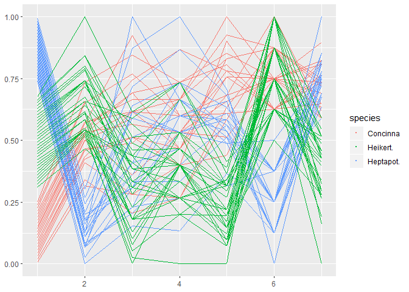

R package for creating parallel coordinate plots in the ggplot2 framework

[](https://cran.r-project.org/package=ggpcp) [](http://www.r-pkg.org/pkg/ggpcp) 
[](https://travis-ci.org/yaweige/ggpcp)


# Installation

`ggpcp` is currently only available in the development version from Github:


```r
# install.packages("devtools")
devtools::install_github("yaweige/ggpcp", build_vignettes = TRUE)
```

# Using the functionality

Load the library


```r
library(ggpcp)
```

Load a dataset


```r
library(tidyverse)
data(flea, package = "GGally")

flea %>% 
  gather_pcp(1:7) %>%
  group_by(name) %>%  # should go into transformation
  mutate(value = (level-min(level))/(max(level)-min(level))) %>%
  ggplot(aes(id = id, name = name, value = value, level = level, class = class)) +
#  geom_pcp() # adding colour is possible once gather_pcp does not delete original data
  geom_pcp(aes(colour=species)) 
```

<!-- -->

# Related work

Parallel coordinate plots have been implemented in analysis software since the mid 1980s (Inselberg 1985, Wegman 1990). Several packages in R are dedicated to visualizing parallel coordinate plots. 

Using base plots the main function for drawing parallel coordinate plots is `parcoord` implemented in MASS (Venables and Ripley 2004). The package `gclus` (Hurley 2019) implements `cparcoord` to include panel color as a representation of the strength of a correlation between neighboring axes.

Within the ggplot2 environment there are several packages implementing parallel coordinate plots. For numeric variables there's the function `ggparcoord` from the `GGally` package, for categorical variables the `ggparallel` package provides an implementation of pcp-like plots, such as the Hammock plot (Schonlau 2003) and parsets (Kosara et al, 2013).

The [bigPint](https://github.com/rstats-gsoc/gsoc2017/wiki/bigPint%3A-Big-multivariate-data-plotted-interactively) Google Summer of Code project  2017 implemented static and interactive versions of parallel coordinate plots within the framework of plotting large data interactively. These functions are meant for exploration and discovery and are not fully parameterized for their appearance.


All of these implementations have in common that they describe highly specialized  plots - in the sense that there are tens of parameters describing construction, type, and appearance of the plot. While giving the user some flexibility this way, this approach goes a bit against the modular approach of the tidyverse, and in particular against the layered approach of ggplot2, i.e. the approaches make use of ggplot2, but are not native to the ggplot2 approach. 

## References
