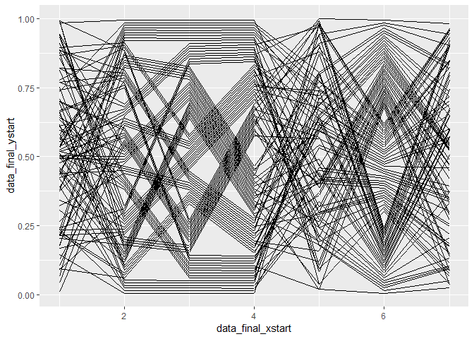

Example
================
Yawei Ge
6/5/2019

``` r
library(ggplot2)
library(dplyr)
library(tidyr)
simpledata3 <- data.frame(x = c(rep("num1", 100),
                                        rep("char2", 100),
                                        rep("char3", 100),
                                        rep("char4", 100),
                                        rep("num5", 100),
                                        rep("char6", 100),
                                        rep("num7", 100)),
                         y = c(round(runif(100), digits = 3),
                                   sample(letters[1:3], size = 100, replace = T),
                                   sample(letters[c(8,6,7)], size = 100, replace = T),
                                   sample(letters[5:4], size = 100, replace = T),
                                   round(runif(100), digits = 3),
                                   sample(letters[c(10,9,11)], size = 100, replace = T),
                                   round(runif(100), digits = 3)))

classpcp3 <- c("numeric", "factor", "factor", "factor", "numeric", "factor", "numeric")
str(simpledata3)
```

    ## 'data.frame':    700 obs. of  2 variables:
    ##  $ x: Factor w/ 7 levels "char2","char3",..: 5 5 5 5 5 5 5 5 5 5 ...
    ##  $ y: Factor w/ 270 levels "0.008","0.017",..: 134 39 120 214 142 107 49 211 26 170 ...

``` r
num <- classpcp3 == "numeric"
fac <- classpcp3 == "factor"
nnum <- sum(classpcp3 == "numeric")
nfac <- sum(classpcp3 == "factor")
nobs <- nrow(simpledata3)/length(classpcp3)

#compute_panel(data, scales, num, fac, nnum, nfac, nobs, classpcp, freespace = 0.1)
final_data <- compute_panel(simpledata3, scales = NULL, num, fac, nnum, nfac, nobs = 100, classpcp = classpcp3)
```

    ## Warning: group_by_() is deprecated. 
    ## Please use group_by() instead
    ## 
    ## The 'programming' vignette or the tidyeval book can help you
    ## to program with group_by() : https://tidyeval.tidyverse.org
    ## This warning is displayed once per session.

``` r
ggplot(final_data) + 
  geom_segment(aes(x = data_final_xstart, y = data_final_ystart, xend = data_final_xend, yend = data_final_yend))
```


