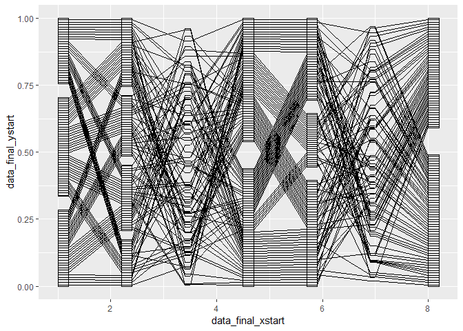

Example
================
Yawei Ge
6/14/2019

``` r
library(ggplot2)
library(dplyr)
library(tidyr)
original_data <- data.frame(
  fac1 = factor(sample(c("a", "b", "c"), size = 100, replace = T), levels = c("a", "b", "c")),
  fac2 = factor(sample(c("male", "dog", "a", "cat"), size = 100, replace = T), levels = c("male", "dog", "a", "cat")),
  num3 = runif(100, min = 0, max = 1),
  fac4 = factor(sample(c("female", "male"), size = 100, replace = T), levels = c("male", "female")),
  fac5 = factor(sample(c("dog", "cat", "bird"), size = 100, replace = T), levels = c("cat", "dog", "bird")),
  num6 = runif(100, min = 0, max = 1),
  fac7 = factor(sample(c("yawei", "ge"), size = 100, replace = T), levels = c("yawei", "ge"))
)
```

``` r
ggplot()   +
  geom_segment(data = data_boxwidth, aes(x = data_final_xstart, y = data_final_ystart, 
                                         xend = data_final_xend, yend = data_final_yend)) +
  geom_segment(data = data_segment, aes(x = data_segment_xstart, y = data_segment_ystart, 
                                        xend = data_segment_xend, yend = data_segment_yend)) + 
  geom_polygon(data = data_box, aes(x = data_box_x, y = data_box_y, group = data_box_group),
               colour = "black", fill = NA)
```


