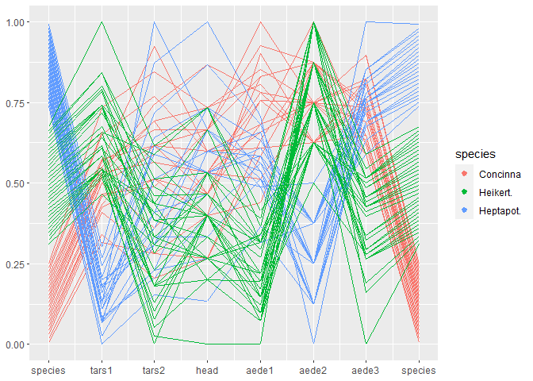
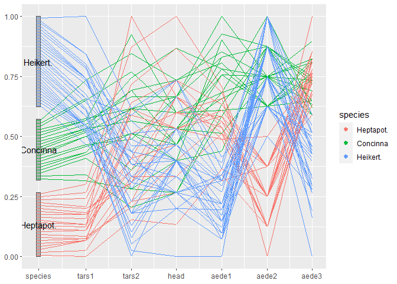
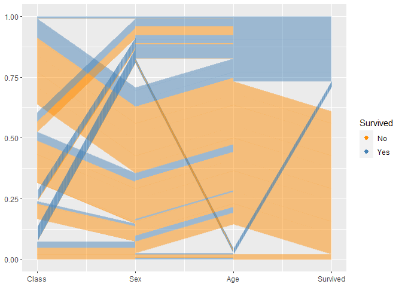
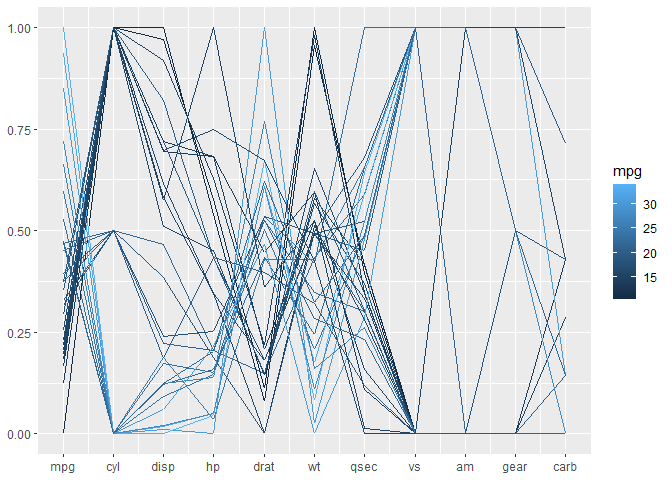

R package for creating parallel coordinate plots in the ggplot2 framework

[](https://cran.r-project.org/package=ggpcp) [](http://www.r-pkg.org/pkg/ggpcp) 
[](https://travis-ci.org/yaweige/ggpcp)


# Installation

`ggpcp` is currently only available in the development version from Github:


```r
# install.packages("devtools")
devtools::install_github("yaweige/ggpcp", build_vignettes = TRUE)
```

# Using the functionality

Load the library


```r
library(ggpcp)
```

Load a dataset


```r
library(tidyverse)
data(flea, package = "GGally")

flea %>% 
  gather_pcp(1:7) %>%
  group_by(name) %>%  # should go into transformation
  mutate(value = (level-min(level))/(max(level)-min(level))) %>%
  ggplot(aes(id = id, name = name, value = value, level = level, class = class)) +
  geom_pcp(aes(colour=species)) 
```

<!-- -->


```r
flea %>% 
  mutate(species = factor(species, levels = c("Heptapot.",  "Concinna", "Heikert."))) %>%
  gather_pcp(1:7) %>%
  group_by(name) %>%  # should go into transformation
  mutate(value = (level-min(level))/(max(level)-min(level))) %>%
  ggplot(aes(id = id, name = name, value = value, level = level, class = class)) +
  geom_pcp_box(boxwidth = 0.1, fill="grey50") +
  geom_pcp(aes(colour=species), boxwidth = 0.1) 
```

<!-- -->

`ggpcp` deals with categorical variables by using the space on the y axis of a categorical variable to spread points out evenly. This allows us to track individual points through the parallel coordinate plot even in the presence of categorical variables. 

## Another look at the Titanic Data

For categorical variables `ggpcp` presents a result similar to parsets by Kosara et al (2013). 


```r
titanic <- as.data.frame(Titanic)
titanic <- titanic %>% 
  purrr::map(.f = function(x) rep(x, titanic$Freq)) %>% 
  as.data.frame() %>% select(-Freq)

titanic %>% 
  gather_pcp(1:4) %>%
  ggplot(aes(id = id, name = name, value = value, level = level, class = class)) + 
  geom_pcp(aes(colour = Survived), alpha = 0.01) +
  scale_colour_manual(values=c("darkorange", "steelblue")) +
  guides(colour=guide_legend(override.aes = list(alpha=1))) +
  scale_x_continuous(breaks=1:4, labels=c(names(titanic))) 
```

<!-- -->

By setting break points between blocks of categorical variables, we can focus on the two-dimensional relationship between variables on adjacent axes:


```r
titanic %>% 
  gather_pcp(1:4) %>%
  ggplot(aes(id = id, name = name, value = value, level = level, class = class)) + 
  geom_pcp(aes(colour = Class), alpha = 0.01, breaks=2:3) +
#  scale_colour_manual(values=c("darkorange", "steelblue")) +
  guides(colour=guide_legend(override.aes = list(alpha=1))) +
  scale_x_continuous(breaks=1:4, labels=c(names(titanic)))
```

<!-- -->

To combine the option of tracking individuals with the focus on 2d relationships between axes, we introduce a box for each axis to allow the tracking. For the thousands of people on board the Titanic individual tracking is tricky, but with good eyesight and a large screen still manageable :)


```r
titanic %>% 
  gather_pcp(1:4) %>%
  ggplot(aes(id = id, name = name, value = value, level = level, class = class)) + 
  geom_pcp_box(boxwidth=0.1, fill=NA) +
  geom_pcp(aes(colour = Class), alpha = 0.01, boxwidth=0.1, breaks=2:3) +
  guides(colour=guide_legend(override.aes = list(alpha=1))) +
  scale_x_continuous(breaks=1:4+ 1:4*0.1-0.05, labels=c(names(titanic)))
```

<!-- -->

## Mixed data: categorical and numeric variables

The `mtcars` data is terribly old, but serves a good purpose here. All of the variables are coded as numeric variables, even when they should, in fact, be factor variables. In a standard parallel coordinate plot we get the usual uninformative fishnet. 

```r
mtcars %>% 
  gather_pcp(1:ncol(mtcars)) %>%
  group_by(name) %>%  # should go into transformation
  mutate(value = (level-min(level))/(max(level)-min(level))) %>%
  ggplot(aes(id = id, name = name, value = value, level = level, class = class)) +
  geom_pcp(aes(colour = mpg)) +
  scale_x_continuous(breaks=1:ncol(mtcars), labels=c(names(mtcars)))
```

<!-- -->
Once the variables are coded properly as factor variables, we get a much more informative view:


```r
mtcars %>% 
  mutate(cyl = factor(cyl),
         vs = factor(vs),
         am = factor(am),
         gear=factor(gear),
         carb = factor(carb)) %>%
  gather_pcp(1:ncol(mtcars)) %>%
  group_by(name) %>%  # should go into transformation
  mutate(value = (level-min(level))/(max(level)-min(level))) %>%
  ggplot(aes(id = id, name = name, value = value, level = level, class = class)) +
  geom_pcp(aes(colour = mpg), boxwidth=0.1) 
```

<!-- -->

```r
  scale_x_continuous(breaks=1:ncol(mtcars), labels=c(names(mtcars)))
```

```
## <ScaleContinuousPosition>
##  Range:  
##  Limits:    0 --    1
```

# Related work

Parallel coordinate plots have been implemented in analysis software since the mid 1980s (Inselberg 1985, Wegman 1990). Several packages in R are dedicated to visualizing parallel coordinate plots. 

Using base plots the main function for drawing parallel coordinate plots is `parcoord` implemented in MASS (Venables and Ripley 2004). The package `gclus` (Hurley 2019) implements `cparcoord` to include panel color as a representation of the strength of a correlation between neighboring axes.

Within the ggplot2 environment there are several packages implementing parallel coordinate plots. For numeric variables there's the function `ggparcoord` from the `GGally` package, for categorical variables the `ggparallel` package provides an implementation of pcp-like plots, such as the Hammock plot (Schonlau 2003) and parsets (Kosara et al, 2013).

The [bigPint](https://github.com/rstats-gsoc/gsoc2017/wiki/bigPint%3A-Big-multivariate-data-plotted-interactively) Google Summer of Code project  2017 implemented static and interactive versions of parallel coordinate plots within the framework of plotting large data interactively. These functions are meant for exploration and discovery and are not fully parameterized for their appearance.


All of these implementations have in common that they describe highly specialized  plots - in the sense that there are tens of parameters describing construction, type, and appearance of the plot. While giving the user some flexibility this way, this approach goes a bit against the modular approach of the tidyverse, and in particular against the layered approach of ggplot2, i.e. the approaches make use of ggplot2, but are not native to the ggplot2 approach. 

## References

+ Hofmann H., Vendettuoli M.: Common Angle Plots as Perception-True Visualizations of Categorical Associations, IEEE Transactions on Visualization and Computer Graphics, 19(12), 2297-2305, 2013.
+ Inselberg A., The Plane with Parallel Coordinates, The Visual Computer, 1(2), 69-91, 1985.
+ Kosara R., Bendix F., Hauser H., Parallel Sets: Interactive Exploration and Visual Analysis of Categorical Data, IEEE Transactions on Visualization and Computer Graphics, 12(4), 558-568, 2006.
+ Schloerke B., Crowley J., Cook D., Briatte F., Marbach M., Thoen E., Elberg ., Larmarange J.: GGally: Extension to 'ggplot2', R package version 1.4.0.
+ Schonlau M.: Visualizing Categorical Data Arising in the Health Sciences Using Hammock Plots, Proc. of Section on Statistical Graphics ASA, 2003.
+ Venables W.N., Ripley B.D.: Modern Applied Statistics with S (4th ed), Springer, 2002.
+ Wegman, E., Hyperdimensional Data Analysis Using Parallel Coordinates, JASA, 85(411), 664-675, 1990.
+ Wickham H., ggplot2: Elegant graphics for data analysis (2nd ed), Springer, 2016
+ Wickham H., Tidy data. The Journal of Statistical Software, 59, 2014.
+ Wilkinson L., The Grammar of Graphics. Statistics and Computing, Springer, 1999. 
